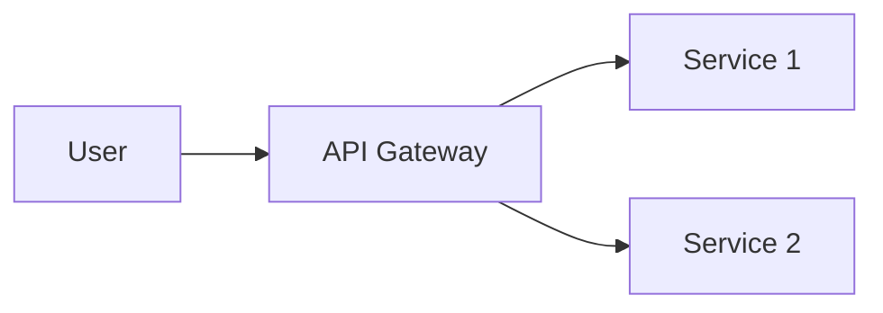

# Documentation as Code

Comprehensive guide to technical writing, docs-as-code practices, API documentation, diagram generation, and documentation automation.

## Purpose

Enable teams to create, maintain, and publish high-quality technical documentation using version control, code review, and CI/CD practices.

## When to Use This Skill

Automatically activates when working on:
- README files and project documentation
- API documentation (OpenAPI/Swagger)
- Architecture diagrams (PlantUML, Mermaid)
- Documentation sites (Docusaurus, MkDocs)
- Technical writing and style guides
- Documentation automation and testing
- Changelog management
- Developer onboarding docs

## Quick Start Checklist

When creating documentation:

- [ ] Write in Markdown (version-controllable)
- [ ] Use clear, concise language
- [ ] Include code examples
- [ ] Add diagrams where helpful
- [ ] Set up docs-as-code workflow (Git + CI/CD)
- [ ] Enable automated link checking
- [ ] Configure spell checking
- [ ] Create table of contents
- [ ] Test code examples
- [ ] Set up documentation site (if needed)

## Core Concepts

### Docs-as-Code Philosophy

**Treat documentation like code:**
```
Version Control → Git (PRs, reviews, history)
Review Process → Pull requests with feedback
CI/CD → Build, test, deploy automatically
Testing → Link checking, spell checking, code validation
Publishing → Automated deployment to docs site
```

### Documentation Types

```
README: Project overview, quick start
API Docs: REST, GraphQL endpoint documentation
Architecture: System design, diagrams, ADRs
Runbooks: Operational procedures
Guides: How-to tutorials, best practices
Reference: API reference, configuration options
Changelog: Version history, release notes
```

## Common Patterns

### Pattern 1: Project README Structure

```markdown
# Project Name

Brief description (1-2 sentences)

## Features

- Feature 1
- Feature 2
- Feature 3

## Quick Start

```bash
npm install
npm run dev
```

## Documentation

- [API Reference](docs/api.md)
- [Architecture](docs/architecture.md)
- [Contributing](CONTRIBUTING.md)

## Installation

Detailed installation instructions

## Usage

Code examples

## Configuration

Environment variables, config files

## Contributing

How to contribute

## License

MIT
```

---
━━━━━━━━━━━━━━━━━━━━━━━━━━━━━━━━━━━━━━━━━━━━━━━━━━━━━━━━━━━━━━━━━━━━━━━━━━━━━━━━
🎯 SKILL ACTIVATED: documentation-as-code
━━━━━━━━━━━━━━━━━━━━━━━━━━━━━━━━━━━━━━━━━━━━━━━━━━━━━━━━━━━━━━━━━━━━━━━━━━━━━━━━


### Pattern 2: API Documentation (OpenAPI)

```yaml
# openapi.yaml
openapi: 3.0.0
info:
  title: User API
  version: 1.0.0

paths:
  /users:
    get:
      summary: List all users
      parameters:
        - name: page
          in: query
          schema:
            type: integer
      responses:
        '200':
          description: Successful response
          content:
            application/json:
              schema:
                type: array
                items:
                  $ref: '#/components/schemas/User'

components:
  schemas:
    User:
      type: object
      properties:
        id:
          type: string
        name:
          type: string
        email:
          type: string
```

---

### Pattern 3: Diagrams as Code

```
PlantUML:
@startuml
User -> API: Request
API -> Database: Query
Database -> API: Result
API -> User: Response
@enduml

Mermaid:

```

## Resource Files

For detailed guidance on specific topics, see:

### Technical Writing
- **[technical-writing-guide.md](resources/technical-writing-guide.md)** - Structure, clarity, examples, audience targeting, style guidelines
- **[markdown-best-practices.md](resources/markdown-best-practices.md)** - GFM, formatting, linking, images, tables, code blocks

### API Documentation
- **[api-documentation.md](resources/api-documentation.md)** - OpenAPI/Swagger, REST docs, GraphQL docs, API design documentation
- **[openapi-specification.md](resources/openapi-specification.md)** - OpenAPI 3.0 spec, schemas, paths, components, examples

### Diagrams & Visualization
- **[diagram-generation.md](resources/diagram-generation.md)** - PlantUML, Mermaid, diagrams.net, C4 model, architecture diagrams
- **[documentation-sites.md](resources/documentation-sites.md)** - Docusaurus, MkDocs, GitBook, VuePress, Astro Starlight

### Automation & Testing
- **[documentation-automation.md](resources/documentation-automation.md)** - Auto-generation, linting, link checking, CI/CD pipelines
- **[readme-engineering.md](resources/readme-engineering.md)** - Project READMEs, structure, badges, quick starts, examples

### Version Control
- **[changelog-management.md](resources/changelog-management.md)** - Keep a Changelog, semantic versioning, release notes, automation
- **[docs-as-code-workflow.md](resources/docs-as-code-workflow.md)** - Git workflow, PR reviews, versioning, deployment strategies

## Best Practices

### 1. Write for Your Audience

**Developer documentation:**
- Technical, concise
- Code examples
- API references

**User documentation:**
- Less technical
- Step-by-step guides
- Screenshots

### 2. Show, Don't Just Tell

```markdown
# ❌ Bad
The API returns user data.

# ✅ Good
The API returns user data in JSON format:

```json
{
  "id": "123",
  "name": "John Doe",
  "email": "john@example.com"
}
```
```

### 3. Keep It Up to Date

- Documentation updates in same PR as code changes
- Automated link checking
- Regular documentation reviews
- Mark deprecated features clearly

### 4. Use Version Control

- All docs in Git
- Pull request reviews
- Track changes over time
- Easy rollback if needed

### 5. Automate Everything

- Build docs automatically (CI/CD)
- Check links (broken link detection)
- Spell check
- Deploy on merge to main

### 6. Make It Searchable

- Use docs site with search (Algolia, etc.)
- Clear headings and structure
- Table of contents
- Good SEO (if public)

## Anti-Patterns to Avoid

❌ Documentation in Word/Google Docs (not version controlled)
❌ Outdated code examples
❌ No diagrams (hard to understand architecture)
❌ Inconsistent formatting
❌ No table of contents (large docs)
❌ Broken links (not tested)
❌ Jargon without explanation
❌ Missing quick start guide

## Common Tasks

### Task: Create OpenAPI Documentation

1. Define API spec in `openapi.yaml`
2. Add schemas, paths, responses
3. Generate docs with Swagger UI or Redoc
4. Host on docs site
5. Keep in sync with code (codegen or validation)

### Task: Set Up Documentation Site

1. Choose tool (Docusaurus, MkDocs, etc.)
2. Initialize site structure
3. Write documentation in Markdown
4. Configure navigation/sidebar
5. Set up CI/CD (deploy on push to main)
6. Add search (Algolia)

### Task: Generate Architecture Diagram

1. Choose tool (PlantUML, Mermaid, draw.io)
2. Create diagram as code
3. Commit to Git (version controlled)
4. Auto-generate PNG/SVG in CI
5. Embed in documentation

## Integration Points

This skill integrates with:
- **skill-developer**: Documenting skills
- **backend-dev-guidelines**: API documentation
- **frontend-dev-guidelines**: Component documentation
- **infrastructure-architecture**: Architecture diagrams and docs
- All skills: Every project needs documentation

## Triggers and Activation

This skill activates when you:
- Edit README or .md files
- Work with OpenAPI/Swagger specs
- Create architecture diagrams
- Set up documentation sites
- Write technical content

---

**Total Resources:** 10 detailed guides covering all aspects of documentation as code
**Focus:** Version control, automation, API docs, diagrams, technical writing
**Maintained by:** Documentation team based on industry best practices
